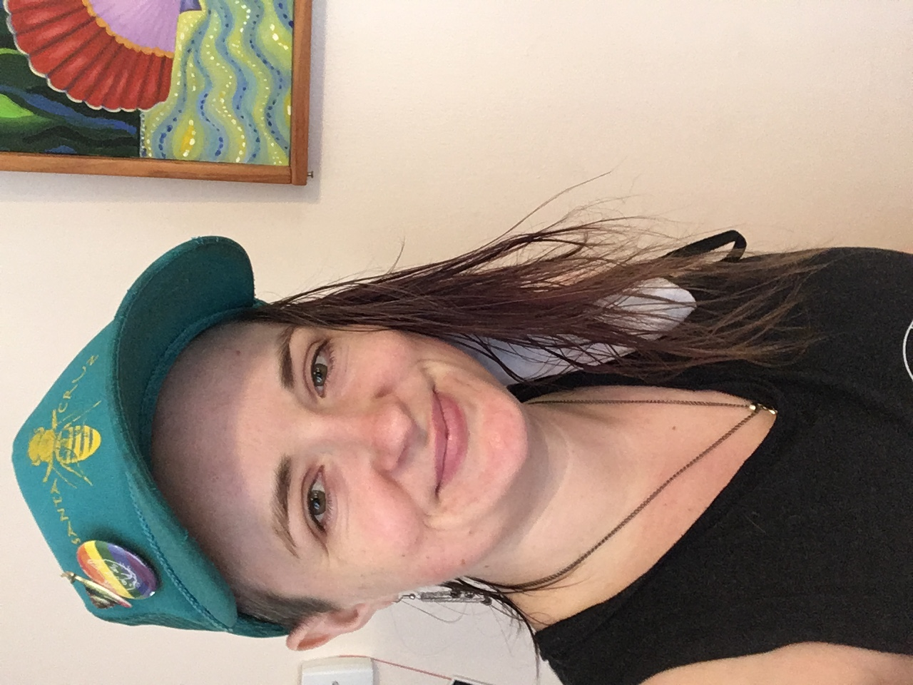

<link rel="stylesheet" href="styles.css" type="text/css">

 

#### I am currently an NSF post-doc working on toad evolution. 

 

#### Feel free to explore the page and contact me. 

 
 

Up to date publication list - [Google Scholar](https://scholar.google.com/citations?user=ZAZY2fUAAAAJ&hl=en&oi=ao">Google Scholar) 
 
 
Cool creatures I've seen recently - [iNaturalist](https://www.inaturalist.org/people/lizardeve)
 
 
Coding projects including this website [GitHub](https://github.com/LizEve)
 
 
My full CV is available [here](files/Mount_CV_9.2021.pdf).
 
 
Selected talks and posters are [here](https://github.com/LizEve/Talks-Posters)
 
 
[Twitter](https://twitter.com/Lizardeve) - with a preview below!
 
 
<!--Embed twitter shit https://publish.twitter.com/#-->

<a class="twitter-timeline" 
data-width="400px" data-height="200px" 
data-theme="dark" 
data-tweet-limit="3"
style = "right:left"
href="https://twitter.com/Lizardeve?ref_src=twsrc%5Etfw">
Tweets by Lizardeve
</a> 

