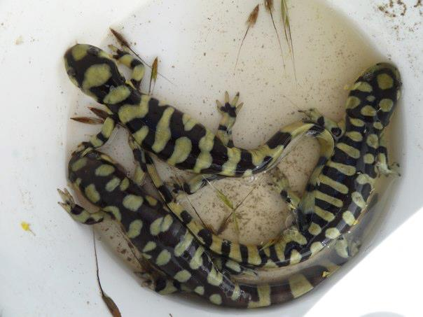
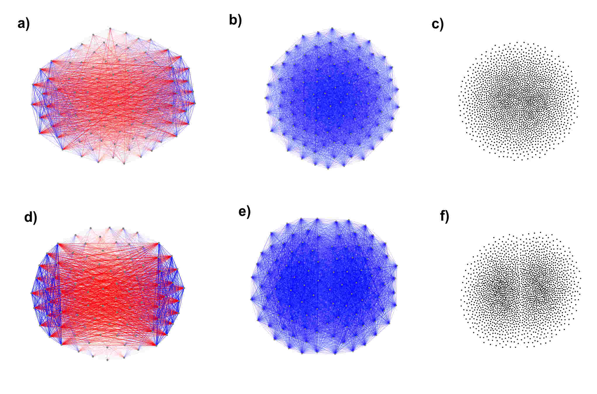
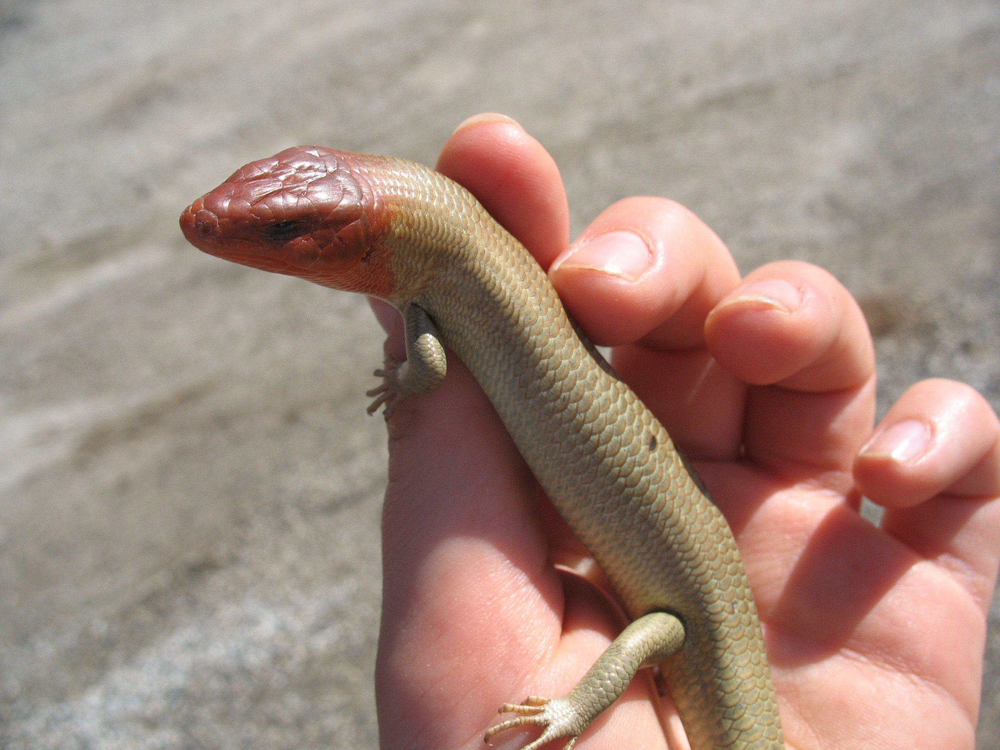
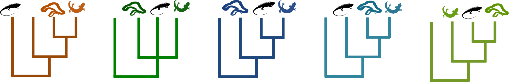
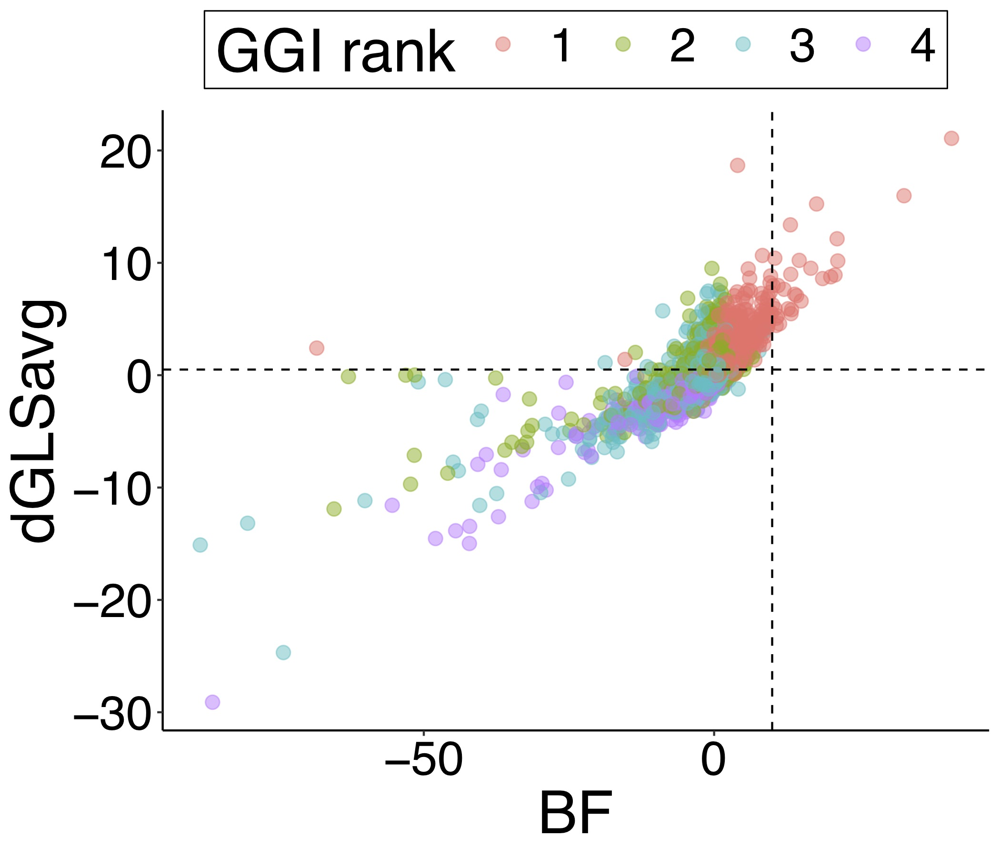

 

Like most biologists I am fascinated by the natural variation in nature. My research is generally focused on translating this variation to understand how it has developed and how it persists. A lot of my PhD research is focused on agnostically capturing the large scale patterns in phylogenetic data. I see this as a first step towards better understanding the  identifying the sources of variation, whether there are biological abnormalities, or systematic bias introduced by inadequate models. 

 
Photo: Tiger salamander hybrids (Ambystoma californiense x tigrinum), Salinas CA

  

## Identifying and visualizing structure in phylogenetic tree sets

 

Variation in inferred gene trees is one of the most striking and consistent observations in phylogenomics. Unraveling the nature and source of this variation is crucial to understanding fundamental aspects of evolution such as molecular evolution across genomes, rates of speciation, hybridization, and patterns of phenotypic evolution. I used simulations to investigate the performance of recently developed network-based community detection approaches , implemented in [TreeScaper](https://github.com/whuang08/TreeScaper/releases), for the identification of such structure. Implementing network methods for identifying structure and clustering information in phylogenetic datasets frees researchers from the loss of information inherent to dimensionality reduction methods. 

 
Figure: Two simulated phylogetetic tree sets analyzed and visualized using a/d) a bipartition network, c/e) a topological network, b/f) 2D Nonlinear dimensionality reduction plot using a robinson-foulds distance matrix
   

## Comparing genome-wide measures of phylogenetic support in squamates
 

  

Multiple recent large phylogenies have found discordant results despite conflicting trees having strong traditional support values. One approach to addressing this discordance is to compare the relative support of the data for each potential topology. I compared multiple recently developed methods to assess the support of the data for the topology using the placement of iguanas within the larger family of lizards and snakes (squamates) as my example data set. I compare bayes factors (BF), gene likelihood scores (dGLS), gene genealogy interrogation (GGI), and gene and site concordance factors to assess their consistency and agreement across multiple squamate data sets. Methods have some variation in how they compare information across loci, indicating that corroborating results with multiple methods is the most robust way to assess support for a given topology.

Figure: Preliminary data of the correlation across methods

							