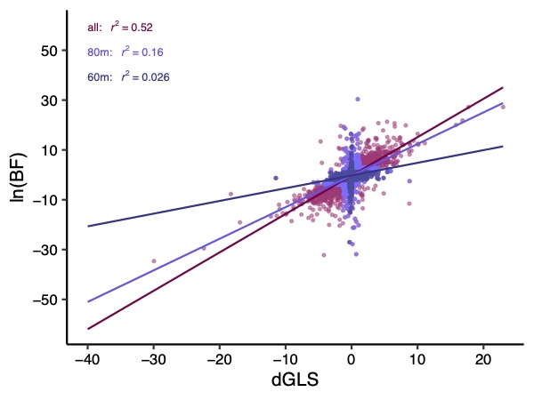

 
 

Like most biologists I am fascinated by the natural variation in nature. I often compliment my cat Athena on her beautiful variation in X chromosome activation.
 
 
My research is generally focused on translating this variation to understand how it has developed and how it persists. A lot of my PhD research is focused on agnostically capturing the large scale patterns in phylogenetic data. I see this as a first step towards better understanding the  identifying the sources of variation, whether there are biological abnormalities, or systematic bias introduced by inadequate models. 

  

## Identifying and visualizing structure in phylogenetic tree sets

 
 

Variation in inferred gene trees is one of the most striking and consistent observations in phylogenomics. I use simulations to investigate the performance of recently developed network-based community detection approaches that aim to explore, identify, and quantify topological variation in phylogenomic data sets.

 

These approaches convert information in the tree set into two different network types: one with trees as nodes and their affinities as edge weights and the other with bipartitions as nodes and covariances in their presence/absence across topologies as edge weights(as pictured here). 

 
 
 

## Comparing likelihood ratios to understand variation in phylogenetic support in squamates
  

Genomic data have not always brought resolution to the tree of life. In some cases large phylogenomic studies reach conflicting conclusions about important phylogenetic relationships, with each mutually exclusive possibility receiving very strong support in individual studies. However, traditional support values (such as bootstrap proportions and posterior probabilities) are meant to measure uncertainty due to sampling error, which is small with larger datasets. 
  
Two strategies for better understanding and addressing phylogenomic conflicts are to examine support on a gene-by-gene basis and to use support values that capture a larger range of variation in phylogenetic information, such as likelihood ratios. I compare the behavior of maximum and marginal likelihood ratios for understanding the distribution of phylogenetic information across genes in four squamate phylogenomic datasets. 

 

  

							